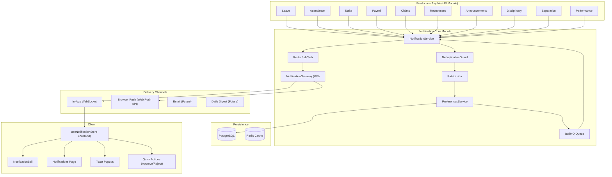

# 🔔 Notifications System — Master Architecture Plan (v2)

> World-class, Google-grade notification infrastructure for a full-stack HR platform.
> Built on NestJS + Drizzle + PostgreSQL + Redis Pub/Sub + WebSocket + BullMQ.

---

## 1. Current State Analysis

| Aspect | Current State | Problem |
|---|---|---|
| **Table** | `task_notifications` | Scoped only to tasks, not system-wide |
| **Service** | Embedded in `TasksService` | Tightly coupled, other modules can't emit notifications cleanly |
| **API** | `GET /tasks/notifications` | Wrong namespace — notifications aren't a "task" sub-resource |
| **Real-time** | ❌ None | Header polls via TanStack Query, no WebSocket push |
| **Coverage** | Only 7 triggers in tasks module | Leave, attendance, payroll, claims, recruitment, etc. are silent |
| **Types** | Free-text `title` + `message` | No category, no priority, no action links, no grouping |
| **Preferences** | ❌ None | Users can't control what they receive |
| **Deduplication** | ❌ None | Same event can fire duplicate notifications |
| **Offline Sync** | ❌ None | No reconnection catch-up strategy |

---

## 2. Target Architecture



---

## 3. Database Schema

### 3.1 `notifications` table (replaces `task_notifications`)

| Column | Type | Purpose |
|---|---|---|
| `id` | UUID PK | Unique ID |
| `created_at` | TIMESTAMPTZ | Created timestamp |
| `updated_at` | TIMESTAMPTZ | Updated timestamp |
| `recipient_id` | UUID FK → employees | Who receives this |
| `actor_id` | UUID FK → employees (nullable) | Who triggered it |
| `module` | VARCHAR(50) | `leave`, `attendance`, `tasks`, `payroll`, `claims`, `recruitment`, `announcements`, `disciplinary`, `separation`, `performance` |
| `category` | VARCHAR(50) | `approval`, `rejection`, `assignment`, `mention`, `reminder`, `status_change`, `comment`, `system`, `broadcast` |
| `priority` | VARCHAR(20) | `low`, `normal`, `high`, `urgent` |
| `title` | VARCHAR(255) | Short title |
| `message` | TEXT | Body text |
| `entity_type` | VARCHAR(50) nullable | e.g., `leave_application`, `task`, `claim` |
| `entity_id` | UUID nullable | FK to source entity |
| `action_url` | VARCHAR(500) nullable | Deep link into the app |
| `actions` | JSONB nullable | Quick-action buttons (see §3.3) |
| `is_read` | BOOLEAN | Default false |
| `read_at` | TIMESTAMPTZ nullable | When it was read |
| `is_archived` | BOOLEAN | Default false (soft-hide from main list) |
| `expires_at` | TIMESTAMPTZ nullable | Auto-hide after this time (for transient reminders) |
| `dedup_key` | VARCHAR(255) nullable | Idempotency key for deduplication |
| `metadata` | JSONB nullable | Extra context (`{ "leaveType": "Sick", "days": 3 }`) |

### 3.2 `notification_preferences` table

| Column | Type | Purpose |
|---|---|---|
| `id` | UUID PK | Unique ID |
| `created_at` | TIMESTAMPTZ | Created timestamp |
| `updated_at` | TIMESTAMPTZ | Updated timestamp |
| `employee_id` | UUID FK → employees (UNIQUE) | One preferences row per user |
| `disabled_modules` | TEXT[] | Modules to mute (e.g., `['tasks', 'announcements']`) |
| `disabled_categories` | TEXT[] | Categories to mute (e.g., `['reminder']`) |
| `email_enabled` | BOOLEAN | Default false (future) |
| `push_enabled` | BOOLEAN | Default true (browser push — future) |
| `quiet_hours_start` | TIME nullable | e.g., `22:00` |
| `quiet_hours_end` | TIME nullable | e.g., `07:00` |
| `digest_frequency` | VARCHAR(20) | `realtime`, `hourly`, `daily` (default `realtime`) |

### 3.3 `actions` JSONB Schema (Quick-Action Buttons)

Notifications can carry actionable buttons that let users respond without leaving the current page:

```json
{
  "actions": [
    {
      "label": "Approve",
      "style": "primary",
      "apiMethod": "PATCH",
      "apiUrl": "/leave-applications/abc123/status",
      "apiBody": { "status": "Approved" },
      "confirmMessage": "Approve this leave request?"
    },
    {
      "label": "Reject",
      "style": "destructive",
      "apiMethod": "PATCH",
      "apiUrl": "/leave-applications/abc123/status",
      "apiBody": { "status": "Rejected" },
      "confirmMessage": "Reject this leave request?"
    }
  ]
}
```

### 3.4 Indexes

```sql
-- Hot path: header bell unread count + recent list
CREATE INDEX idx_notifications_recipient_unread
  ON notifications (recipient_id, is_read, created_at DESC)
  WHERE is_archived = false;

-- Module filtering on notifications page
CREATE INDEX idx_notifications_recipient_module
  ON notifications (recipient_id, module, created_at DESC)
  WHERE is_archived = false;

-- Entity-based lookups
CREATE INDEX idx_notifications_entity
  ON notifications (entity_type, entity_id);

-- Deduplication lookup (must be fast)
CREATE UNIQUE INDEX idx_notifications_dedup
  ON notifications (dedup_key)
  WHERE dedup_key IS NOT NULL;

-- TTL cleanup: find expired notifications
CREATE INDEX idx_notifications_expires
  ON notifications (expires_at)
  WHERE expires_at IS NOT NULL AND is_read = false;

-- Preferences lookup (one per user)
CREATE UNIQUE INDEX idx_notification_prefs_employee
  ON notification_preferences (employee_id);
```

---

## 4. Core Engine — Smart Pipeline

Every `emit()` call flows through a **4-stage pipeline** before delivery:

```
emit(dto) → [1. Dedup Guard] → [2. Rate Limiter] → [3. Preferences Check] → [4. Deliver]
```

### 4.1 Deduplication Guard

Prevents duplicate notifications from retries, race conditions, or double-fires:

```typescript
class DeduplicationGuard {
  // Generate dedup_key from: module + category + recipientId + entityId + time window
  // Example: "leave:approval:manager123:leave_app456:2025-06-21T10"
  // Check Redis SET with 5-minute TTL before inserting
  // If key exists → skip (return existing notification)
  // If not → SET key, proceed with insert

  async shouldEmit(dto: EmitNotificationDto): Promise<boolean>
  async markEmitted(dto: EmitNotificationDto): Promise<void>
}
```

**Dedup key format:** `{module}:{category}:{recipientId}:{entityId}:{timeBucket}`
- `timeBucket` = ISO timestamp truncated to 5-minute windows
- Ensures the same logical event within 5 minutes produces exactly 1 notification

### 4.2 Rate Limiter

Prevents notification storms that overwhelm users:

```typescript
class NotificationRateLimiter {
  // Redis sliding-window counter per recipient
  // Limits: max 50 notifications per user per hour
  // When limit hit → queue excess for "digest" delivery
  // Admin broadcasts bypass rate limiting

  async canDeliver(recipientId: string, priority: string): Promise<boolean>
}
```

**Rules:**
| Priority | Rate Limit | Behavior When Exceeded |
|---|---|---|
| `urgent` | No limit | Always delivered immediately |
| `high` | 30/hour | Queued for digest |
| `normal` | 50/hour | Queued for digest |
| `low` | 100/hour | Silently dropped |

### 4.3 Preferences Check

Respects user notification preferences:

```typescript
class PreferencesService {
  // Cached in Redis per user (TTL 5 min, invalidated on settings change)
  // Checks:
  //   1. Is the module disabled? → skip
  //   2. Is the category disabled? → skip
  //   3. Is it quiet hours? → queue for later delivery
  //   4. Urgent priority always bypasses preferences

  async shouldDeliver(recipientId: string, dto: EmitNotificationDto): Promise<{
    deliver: boolean;
    reason?: 'muted_module' | 'muted_category' | 'quiet_hours' | 'rate_limited';
    deliverAt?: Date; // delayed delivery time
  }>
}
```

### 4.4 Delivery Engine

```typescript
class DeliveryEngine {
  // 1. Insert into PostgreSQL
  // 2. Publish to Redis 'notification_events' channel
  // 3. NotificationGateway delivers to connected WebSocket clients
  // 4. If user is offline → notification persists in DB, delivered on reconnect
  // 5. If priority is urgent/high → also queue browser push (future)

  async deliver(notification: Notification): Promise<void>
  async deliverBulk(notifications: Notification[]): Promise<void>
}
```

---

## 5. Backend Module Structure

### Directory Layout

```
src/modules/notifications/
├── notifications.module.ts            # NestJS module
├── notifications.service.ts           # Emit + CRUD
├── notifications.controller.ts        # REST API
├── notifications.gateway.ts           # WebSocket gateway
├── notifications.processor.ts         # BullMQ worker (digest, cleanup, delayed delivery)
├── guards/
│   ├── deduplication.guard.ts         # Idempotency check
│   └── rate-limiter.guard.ts          # Storm protection
├── services/
│   ├── preferences.service.ts         # User notification preferences
│   └── delivery.service.ts            # Multi-channel delivery orchestrator
├── dto/
│   ├── emit-notification.dto.ts       # What modules call
│   ├── notification-query.dto.ts      # List/filter params
│   └── preferences.dto.ts             # Update preferences
└── types/
    └── notification.types.ts          # Enums, interfaces
```

### 5.1 NotificationService — Core API

```typescript
@Injectable()
export class NotificationService {
  constructor(
    @Inject(DB_CONNECTION) private readonly db: Database,
    @InjectQueue(NOTIFICATION_QUEUE) private readonly queue: Queue,
    private readonly gateway: NotificationGateway,
    @Inject(REDIS_CLIENT) private readonly redis: Redis,
    private readonly dedup: DeduplicationGuard,
    private readonly rateLimiter: NotificationRateLimiter,
    private readonly preferences: PreferencesService,
  ) {}

  // ─── Emit Pipeline ──────────────────────────────────────────────
  async emit(dto: EmitNotificationDto): Promise<Notification | null> {
    // 1. Dedup check
    if (await this.dedup.shouldEmit(dto) === false) return null;

    // 2. Preferences check
    const pref = await this.preferences.shouldDeliver(dto.recipientId, dto);
    if (!pref.deliver) {
      if (pref.deliverAt) {
        // Queue for delayed delivery (after quiet hours)
        await this.queue.add('delayed-delivery', dto, { delay: pref.deliverAt.getTime() - Date.now() });
      }
      return null;
    }

    // 3. Rate limit check
    if (await this.rateLimiter.canDeliver(dto.recipientId, dto.priority || 'normal') === false) {
      await this.queue.add('digest', dto);
      return null;
    }

    // 4. Mark dedup key
    await this.dedup.markEmitted(dto);

    // 5. Persist + deliver
    const notification = await this.persist(dto);
    await this.gateway.pushToUser(dto.recipientId, 'notification_new', notification);

    return notification;
  }

  async emitBulk(dtos: EmitNotificationDto[]): Promise<void> {
    // Process each through pipeline (parallel with concurrency limit)
  }

  // ─── CRUD ────────────────────────────────────────────────────────
  async findAll(recipientId: string, query: NotificationQueryDto)
  async getUnreadCount(recipientId: string)
  async markAsRead(id: string, recipientId: string)
  async markAllAsRead(recipientId: string)
  async archive(id: string, recipientId: string)
  async archiveAllRead(recipientId: string)
  async delete(id: string, recipientId: string)
  async executeAction(notificationId: string, actionIndex: number, userId: string)
}
```

### 5.2 EmitNotificationDto

```typescript
export class EmitNotificationDto {
  @IsUUID() recipientId: string;
  @IsOptional() @IsUUID() actorId?: string;
  @IsEnum(NotificationModule) module: NotificationModule;
  @IsEnum(NotificationCategory) category: NotificationCategory;
  @IsOptional() @IsEnum(['low', 'normal', 'high', 'urgent']) priority?: string;
  @IsString() @MaxLength(255) title: string;
  @IsString() message: string;
  @IsOptional() @IsString() entityType?: string;
  @IsOptional() @IsUUID() entityId?: string;
  @IsOptional() @IsString() actionUrl?: string;
  @IsOptional() actions?: NotificationAction[];
  @IsOptional() metadata?: Record<string, any>;
  @IsOptional() @IsString() dedupKey?: string; // Custom dedup key override
  @IsOptional() expiresAt?: Date; // For transient reminders
}

export interface NotificationAction {
  label: string;
  style: 'primary' | 'secondary' | 'destructive';
  apiMethod: 'POST' | 'PATCH' | 'DELETE';
  apiUrl: string;
  apiBody?: Record<string, any>;
  confirmMessage?: string;
}
```

### 5.3 REST API Endpoints

| Method | Endpoint | Purpose |
|---|---|---|
| `GET` | `/notifications` | List (cursor-paginated, filterable) |
| `GET` | `/notifications/unread-count` | Lightweight badge count |
| `GET` | `/notifications/sync?since={ISO}` | Reconnection sync — all notifications since timestamp |
| `PATCH` | `/notifications/:id/read` | Mark single as read |
| `POST` | `/notifications/mark-all-read` | Mark all as read |
| `PATCH` | `/notifications/:id/archive` | Archive single |
| `POST` | `/notifications/archive-all-read` | Archive all read |
| `DELETE` | `/notifications/:id` | Hard delete single |
| `DELETE` | `/notifications/archived` | Hard delete all archived |
| `POST` | `/notifications/:id/actions/:index` | Execute quick-action button |
| `GET` | `/notifications/preferences` | Get current user's preferences |
| `PATCH` | `/notifications/preferences` | Update preferences |
| `POST` | `/notifications/broadcast` | Admin: send to all/specific users |

### 5.4 NotificationQueryDto

```typescript
export class NotificationQueryDto {
  @IsOptional() @IsString() module?: string;
  @IsOptional() @IsString() category?: string;
  @IsOptional() @IsString() isRead?: string;       // 'true' | 'false'
  @IsOptional() @IsString() isArchived?: string;    // default 'false'
  @IsOptional() @IsString() priority?: string;
  @IsOptional() @IsString() cursor?: string;        // ISO timestamp cursor
  @IsOptional() @IsInt() @Max(50) limit?: number;   // Default 20, max 50
}
```

### 5.5 NotificationGateway — WebSocket Real-Time Push

```typescript
@WebSocketGateway(WS_PORT, { path: '/ws/notifications' })
export class NotificationGateway implements OnGatewayInit, OnGatewayConnection, OnGatewayDisconnect {
  // Architecture mirrors chat.gateway.ts:

  private localClients = new Map<string, ExtendedWebSocket[]>();
  private heartbeatIntervalId: NodeJS.Timeout;

  async afterInit() {
    // 1. Subscribe to Redis 'notification_events' channel
    // 2. Start 30s heartbeat interval
  }

  async handleConnection(client: WebSocket) {
    // 1. Extract JWT from query param
    // 2. Verify token, extract employeeId
    // 3. Add to localClients map
    // 4. Send connection_ack
    // 5. Send missed notifications since last seen (reconnection sync)
  }

  async handleDisconnect(client: WebSocket) {
    // 1. Remove from localClients
    // 2. Record lastSeenAt timestamp in Redis
  }

  // Redis sync handler — routes events to local clients
  private handleRedisSyncEvent(payload) {
    // For NEW/READ/ARCHIVED/DELETED events
    // Find recipient's local sockets and push
  }

  pushToUser(employeeId: string, event: string, data: any) {
    // Deliver to ALL open tabs for that user
    const sockets = this.localClients.get(employeeId) || [];
    sockets.forEach(ws => {
      if (ws.readyState === WebSocket.OPEN) {
        ws.send(JSON.stringify({ event, data }));
      }
    });
  }
}
```

#### WebSocket Events

| Event | Direction | Payload |
|---|---|---|
| `connection_ack` | Server → Client | `{ status: 'connected', lastSeenAt: ISO }` |
| `notification_new` | Server → Client | Full notification object |
| `notification_read` | Server → Client | `{ id, readAt }` |
| `notification_mark_all_read` | Server → Client | `{ readAt }` |
| `notification_archived` | Server → Client | `{ id }` |
| `notification_deleted` | Server → Client | `{ id }` |
| `notification_action_result` | Server → Client | `{ notificationId, actionIndex, success, response }` |
| `reconnect_sync` | Server → Client | `{ notifications: [...missed], unreadCount }` |

#### Reconnection Sync Protocol

```
1. Client disconnects (network issue, tab closed, etc.)
2. Gateway records lastSeenAt = now() in Redis key: notif:last_seen:{employeeId}
3. While offline, notifications accumulate in PostgreSQL
4. Client reconnects with WebSocket
5. Gateway reads lastSeenAt from Redis
6. Queries: SELECT * FROM notifications
            WHERE recipient_id = ? AND created_at > lastSeenAt
            ORDER BY created_at DESC LIMIT 50
7. Sends 'reconnect_sync' event with all missed notifications
8. Client merges into Zustand store
```

### 5.6 NotificationProcessor — BullMQ Worker

```typescript
@Processor(NOTIFICATION_QUEUE)
export class NotificationProcessor extends WorkerHost {
  // Job types:
  //
  // 1. 'delayed-delivery'
  //    - Sent during quiet hours
  //    - Processes after quiet hours end
  //
  // 2. 'batch-broadcast'
  //    - Admin sends notification to all employees
  //    - Processes in chunks of 100 to avoid DB overload
  //    - Uses insertMany + bulk Redis publish
  //
  // 3. 'daily-digest' (cron: 0 9 * * *)
  //    - Groups unread notifications per user by module
  //    - Creates a single digest notification:
  //      "You have 12 unread notifications: 5 leave approvals, 3 task updates, ..."
  //
  // 4. 'cleanup-expired'  (cron: 0 3 * * *)
  //    - Auto-archive notifications past expires_at
  //    - Hard-delete archived notifications older than 90 days
  //
  // 5. 'action-execute'
  //    - Processes quick-action button clicks asynchronously
  //    - Executes the API call defined in notification.actions[index]
  //    - Updates notification metadata with action result
}
```

### 5.7 Admin Broadcast Endpoint

```typescript
@Post('broadcast')
@Roles('admin')
async broadcast(@Body() dto: BroadcastDto) {
  // Send notification to ALL active employees or filtered list
  // Uses BullMQ batch-broadcast job for large audiences
  // Example: "Company holiday on Friday" → all employees
}

export class BroadcastDto {
  @IsString() @MaxLength(255) title: string;
  @IsString() message: string;
  @IsOptional() @IsUUID({}, { each: true }) recipientIds?: string[]; // specific users
  @IsOptional() @IsString() actionUrl?: string;
  @IsOptional() @IsEnum(['low', 'normal', 'high', 'urgent']) priority?: string;
}
```

---

## 6. Integration Points — Where Notifications Fire

### 6.1 Leave Module

| Trigger | Recipient | Category | Priority | actionUrl | Quick Actions |
|---|---|---|---|---|---|
| Employee applies for leave | Manager/HR | `approval` | Normal | `/leave` | Approve / Reject |
| Leave approved | Employee | `status_change` | Normal | `/leave` | — |
| Leave rejected | Employee | `status_change` | High | `/leave` | — |
| Leave cancelled | Manager/HR | `status_change` | Normal | `/leave` | — |
| Leave balance low (< 2 days) | Employee | `reminder` | Low | `/leave` | — |

### 6.2 Attendance Module

| Trigger | Recipient | Category | Priority | actionUrl | Expires At |
|---|---|---|---|---|---|
| Late check-in | Employee | `reminder` | Low | `/attendance` | End of day |
| Absent (auto-marked) | Employee + Manager | `system` | High | `/attendance` | — |
| Correction request | HR/Admin | `approval` | Normal | `/attendance` | — |
| Correction resolved | Employee | `status_change` | Normal | `/attendance` | — |

### 6.3 Tasks Module (migrate existing)

| Trigger | Recipient | Category | Priority | actionUrl | Dedup Key |
|---|---|---|---|---|---|
| Task assigned | Assignee | `assignment` | Normal | `/tasks` | `tasks:assignment:{assignee}:{taskId}` |
| Status changed | Assignee + Reporter | `status_change` | Normal | `/tasks` | `tasks:status:{taskId}:{5min}` |
| Priority changed | Assignee | `status_change` | High | `/tasks` | — |
| Due in 24h | Assignee | `reminder` | High | `/tasks` | `tasks:due_soon:{taskId}` |
| Overdue | Assignee + Manager | `reminder` | Urgent | `/tasks` | `tasks:overdue:{taskId}:{day}` |
| Comment added | Assignee | `comment` | Normal | `/tasks` | — |
| @mention | Mentioned users | `mention` | High | `/tasks` | — |

### 6.4 Payroll Module

| Trigger | Recipient | Category | Priority | actionUrl |
|---|---|---|---|---|
| Payslip generated | Employee | `system` | Normal | `/payroll` |
| Payroll batch processed | All employees | `broadcast` | Normal | `/payroll` |
| Festival bonus | Employee | `system` | Normal | `/payroll` |

### 6.5 Claims Module

| Trigger | Recipient | Category | Priority | actionUrl | Quick Actions |
|---|---|---|---|---|---|
| Claim submitted | HR/Admin | `approval` | Normal | `/claims/medical` | Approve / Reject |
| Claim approved | Employee | `status_change` | Normal | `/claims` | — |
| Claim rejected | Employee | `status_change` | High | `/claims` | — |

### 6.6 Recruitment Module

| Trigger | Recipient | Category | Priority | actionUrl |
|---|---|---|---|---|
| New application | HR/Recruiter | `system` | Normal | `/recruitment` |
| Status changed | Internal candidate | `status_change` | Normal | `/recruitment` |
| Interview scheduled | Interviewer + Candidate | `reminder` | High | `/recruitment` |

### 6.7 Announcements Module

| Trigger | Recipient | Category | Priority | actionUrl |
|---|---|---|---|---|
| New announcement | All/targeted employees | `broadcast` | Normal | `/announcements` |

### 6.8 Performance Module

| Trigger | Recipient | Category | Priority | actionUrl |
|---|---|---|---|---|
| Review assigned | Manager | `assignment` | Normal | `/performance` |
| Review completed | Employee | `status_change` | Normal | `/performance` |

### 6.9 Disciplinary / Separation

| Trigger | Recipient | Category | Priority | actionUrl |
|---|---|---|---|---|
| Disciplinary action | Employee | `system` | Urgent | `/disciplinary` |
| Separation request | HR/Admin | `approval` | High | `/separation` |
| Separation approved | Employee | `status_change` | High | `/separation` |

---

## 7. Frontend Architecture

### 7.1 New Files

```
client/src/
├── hooks/
│   ├── useNotifications.ts              # TanStack Query hooks (list, CRUD)
│   └── useNotificationSocket.ts         # WebSocket connection hook
├── components/
│   └── notifications/
│       ├── notification-bell.tsx         # Header bell (extracted from header.tsx)
│       ├── notification-list.tsx         # Reusable list component
│       ├── notification-item.tsx         # Single notification card with actions
│       ├── notification-icon.tsx         # Module → icon/color mapper
│       ├── notification-preferences.tsx  # Preferences settings component
│       └── notification-actions.tsx      # Quick-action button handler
├── routes/pages/
│   └── notifications.tsx                # Full /notifications page
├── store/
│   └── useNotificationStore.ts          # Zustand store
├── types/
│   └── notifications.ts                 # TypeScript interfaces
```

### 7.2 useNotificationStore (Zustand)

```typescript
interface NotificationState {
  notifications: Notification[];
  unreadCount: number;
  wsConnected: boolean;
  lastSyncedAt: string | null;

  // Real-time actions (called by WebSocket hook)
  addNotification: (n: Notification) => void;
  markAsRead: (id: string) => void;
  markAllAsRead: () => void;
  archiveNotification: (id: string) => void;
  removeNotification: (id: string) => void;

  // Bulk operations
  setNotifications: (list: Notification[]) => void;
  mergeNotifications: (list: Notification[]) => void; // for reconnect sync

  // Connection state
  setWsConnected: (v: boolean) => void;
  setLastSyncedAt: (ts: string) => void;
}
```

### 7.3 useNotificationSocket Hook

```typescript
export function useNotificationSocket() {
  // Connects to ws://host/ws/notifications?token=xxx
  // Auto-reconnect with exponential backoff (same pattern as chat)
  //
  // On 'notification_new':
  //   → addNotification() to store
  //   → Show Sonner toast (configurable by priority):
  //     - urgent: always toast with sound
  //     - high: toast, no sound
  //     - normal/low: silent, badge only
  //
  // On 'reconnect_sync':
  //   → mergeNotifications() into store
  //   → Update unreadCount
  //
  // On 'notification_read' / 'notification_mark_all_read':
  //   → Update store state (cross-tab sync)
  //
  // On 'notification_archived':
  //   → Remove from visible list
  //
  // On 'notification_action_result':
  //   → Show success/error toast
  //   → Invalidate related TanStack Query cache
}
```

### 7.4 Notification Bell (Header Component)

Extract from `header.tsx` into dedicated `notification-bell.tsx`:
- **Badge**: Real-time unread count from Zustand (no polling)
- **Dropdown**: Last 15 notifications, scrollable
- **Item layout**: Module icon + title + message + relative time + unread dot
- **Click behavior**: Navigate to `actionUrl` + mark as read
- **Quick actions**: If notification has `actions[]`, render approve/reject buttons inline
- **Footer**: "View All" → `/notifications` | "Mark All Read"
- **Empty state**: Illustration + "No notifications yet"

### 7.5 Full Notifications Page (`/notifications`)

**Layout:**
```
┌─────────────────────────────────────────────────┐
│  Notifications          [Mark All Read] [⚙ Prefs]│
├─────────────────────────────────────────────────┤
│  [All] [Unread] [Leave] [Tasks] [Payroll] [...]  │
├─────────────────────────────────────────────────┤
│  🔴 Leave Approval Request                       │
│     John Doe applied for 3 days sick leave       │
│     [Approve] [Reject]          2 min ago        │
│                                                  │
│  ● Task Assigned to You                          │
│     "Update payroll module" assigned by Jane      │
│     → /tasks                    1 hour ago       │
│                                                  │
│  ✓ Payslip Generated                             │
│     Your June 2025 payslip is ready              │
│     → /payroll                  Yesterday        │
│                                                  │
│  ─── Load More ───                               │
└─────────────────────────────────────────────────┘
```

**Features:**
- Tab filters: **All** | **Unread** | **Leave** | **Tasks** | **Payroll** | **Claims** | **Attendance** | **Other**
- Cursor-based infinite scroll (matches announcements pattern)
- Swipe-to-archive on mobile
- Bulk actions: "Mark All Read", "Archive All Read"
- Quick-action buttons rendered inline for approval-type notifications
- Relative timestamps ("2 min ago", "Yesterday", "Jun 18")
- Module-specific icons and colors

### 7.6 Notification Preferences Page

Accessible via Settings or the ⚙ button on notifications page:

```
┌───────────────────────────────────────┐
│  Notification Preferences             │
├───────────────────────────────────────┤
│                                       │
│  Module Notifications                 │
│  ☑ Leave        ☑ Tasks              │
│  ☑ Attendance   ☐ Payroll (muted)    │
│  ☑ Claims       ☑ Recruitment        │
│  ☑ Announcements ☑ Performance       │
│  ☑ Disciplinary  ☑ Separation        │
│                                       │
│  Category Filters                     │
│  ☑ Approvals    ☑ Assignments        │
│  ☐ Reminders (muted)                 │
│  ☑ Status Changes ☑ Comments         │
│  ☑ Mentions     ☑ System             │
│                                       │
│  Quiet Hours                          │
│  From: [22:00]  To: [07:00]          │
│  (Urgent notifications bypass quiet   │
│   hours and always deliver)           │
│                                       │
│  Delivery                             │
│  ● Real-time  ○ Hourly  ○ Daily      │
│                                       │
│  ☐ Enable email notifications (soon)  │
│  ☑ Enable browser push (soon)         │
│                                       │
│           [Save Preferences]          │
└───────────────────────────────────────┘
```

### 7.7 TypeScript Types

```typescript
export interface Notification {
  id: string;
  createdAt: string;
  updatedAt: string;
  recipientId: string;
  actorId: string | null;
  module: NotificationModule;
  category: NotificationCategory;
  priority: NotificationPriority;
  title: string;
  message: string;
  entityType: string | null;
  entityId: string | null;
  actionUrl: string | null;
  actions: NotificationAction[] | null;
  isRead: boolean;
  readAt: string | null;
  isArchived: boolean;
  expiresAt: string | null;
  metadata: Record<string, any> | null;
}

export interface NotificationAction {
  label: string;
  style: 'primary' | 'secondary' | 'destructive';
  apiMethod: 'POST' | 'PATCH' | 'DELETE';
  apiUrl: string;
  apiBody?: Record<string, any>;
  confirmMessage?: string;
}

export type NotificationPriority = 'low' | 'normal' | 'high' | 'urgent';

export type NotificationModule =
  | 'leave' | 'attendance' | 'tasks' | 'payroll'
  | 'claims' | 'recruitment' | 'announcements'
  | 'performance' | 'disciplinary' | 'separation';

export type NotificationCategory =
  | 'approval' | 'rejection' | 'assignment' | 'mention'
  | 'reminder' | 'status_change' | 'comment' | 'system' | 'broadcast';

export interface NotificationPreferences {
  employeeId: string;
  disabledModules: NotificationModule[];
  disabledCategories: NotificationCategory[];
  emailEnabled: boolean;
  pushEnabled: boolean;
  quietHoursStart: string | null; // "22:00"
  quietHoursEnd: string | null;   // "07:00"
  digestFrequency: 'realtime' | 'hourly' | 'daily';
}

export interface NotificationListResponse {
  data: Notification[];
  nextCursor: string | null;
  totalCount: number;
}
```

---

## 8. Real-Time Flow (End-to-End)

### 8.1 Normal Flow (User Online)

```
1. Employee submits leave request
   ↓
2. LeaveApplicationService.createAsync()
   → calls NotificationService.emit({
       recipientId: managerId,
       module: 'leave',
       category: 'approval',
       priority: 'normal',
       title: 'Leave Approval Request',
       message: 'John Doe applied for 3 days sick leave',
       entityType: 'leave_application',
       entityId: leaveAppId,
       actionUrl: '/leave',
       actions: [{ label: 'Approve', ... }, { label: 'Reject', ... }],
     })
   ↓
3. Notification Pipeline:
   a. DeduplicationGuard → check Redis key, not duplicate ✓
   b. PreferencesService → manager hasn't muted leave approvals ✓
   c. RateLimiter → 12/50 this hour ✓
   d. Persist → INSERT INTO notifications
   e. Redis PUBLISH 'notification_events'
   ↓
4. NotificationGateway:
   → pushToUser(managerId, 'notification_new', notification)
   ↓
5. Client useNotificationSocket:
   a. addNotification() to Zustand store
   b. Sonner toast: "Leave Approval Request — John Doe applied for 3 days"
   c. Bell badge: unreadCount++ → renders "13"
   ↓
6. Manager clicks [Approve] button in notification:
   → POST /notifications/:id/actions/0
   → NotificationService.executeAction():
     a. Reads actions[0] → PATCH /leave-applications/{id}/status { status: 'Approved' }
     b. Executes the API call internally
     c. Updates notification metadata: { actionTaken: 'Approve', actionBy: managerId }
     d. Emits new notification to employee: "Your leave was approved"
     e. Pushes 'notification_action_result' to manager's socket
   → Client shows toast: "Leave approved successfully"
   → Invalidates leave-applications TanStack Query cache
```

### 8.2 Offline → Reconnect Flow

```
1. User goes offline (laptop sleep, network loss)
2. Gateway detects disconnect, records lastSeenAt in Redis
3. During offline period, 5 notifications are emitted for this user
   → All persisted to PostgreSQL, WebSocket delivery skipped (no sockets)
   ↓
4. User comes back online, WebSocket reconnects
5. Gateway reads lastSeenAt from Redis (e.g., 2 hours ago)
6. Queries: SELECT * FROM notifications
            WHERE recipient_id = ? AND created_at > '2 hours ago'
            ORDER BY created_at DESC LIMIT 50
7. Sends 'reconnect_sync' event with 5 missed notifications
8. Client useNotificationSocket:
   → mergeNotifications() into Zustand store
   → Badge updates: "5 new"
   → No toasts for old notifications (only toast for real-time new ones)
```

### 8.3 Cross-Tab Sync Flow

```
1. User has 3 browser tabs open (all connected via WebSocket)
2. In Tab A, user marks notification as read
3. Tab A: PATCH /notifications/:id/read → optimistic Zustand update
4. Server: updates DB + Redis PUBLISH 'notification_events' { type: 'READ', id }
5. NotificationGateway receives event
6. Pushes 'notification_read' to ALL sockets for this user (Tabs A, B, C)
7. Tabs B and C: Zustand store marks notification as read
8. All tabs now show consistent state
```

---

## 9. Security & Authorization

| Concern | Strategy |
|---|---|
| **Notification isolation** | Every query/action is scoped to `WHERE recipient_id = authenticatedUserId`. No user can read others' notifications. |
| **WebSocket auth** | JWT token in query param, verified on connection. Invalid token → connection rejected with 4001. |
| **Action execution** | Quick-actions are executed server-side with the notification recipient's identity. The action API endpoint validates role permissions independently. |
| **Admin broadcast** | Only `admin` role can call `POST /notifications/broadcast`. Rate-limited to 1 broadcast per 5 minutes. |
| **PII in notifications** | Metadata field can contain sensitive data (salary amounts). Frontend must respect role-based rendering. |
| **XSS prevention** | All `title`, `message`, `actionUrl` fields are validated and sanitized on insert. Frontend uses React's built-in escaping. |

---

## 10. Performance & Scalability

| Concern | Strategy |
|---|---|
| **High-volume reads** | Partial index `WHERE is_archived = false` keeps the hot path small. Old notifications auto-archive. |
| **Broadcast to 500+ users** | `emitBulk()` uses batch INSERT + chunked Redis PUBLISH. BullMQ `batch-broadcast` job processes in groups of 100. |
| **WebSocket connection count** | Each user can have multiple tabs (multiple sockets). Map<employeeId, WebSocket[]> handles this. Heartbeat prunes dead connections. |
| **Redis Pub/Sub fan-out** | Single publish, gateway filters by recipient locally. No per-user Redis channels (avoids channel explosion). |
| **Notification table growth** | `cleanup-expired` job runs daily at 3 AM. Read notifications older than 90 days are hard-deleted. Unread older than 90 days are auto-archived. |
| **Dedup key index** | UNIQUE partial index on `dedup_key WHERE NOT NULL` ensures O(1) duplicate checks. |
| **Preferences caching** | Cached in Redis per user with 5-minute TTL. Invalidated on preference update. Avoids DB hit on every emit. |
| **Unread count** | Redis counter `notif:unread:{employeeId}` incremented/decremented atomically. Falls back to DB COUNT on cache miss. |

---

## 11. Migration Strategy

### Phase 1: Foundation (Backend Core)
1. Create `notifications` + `notification_preferences` Drizzle schemas
2. Write and run migration: create tables + indexes
3. Create `NotificationsModule` directory scaffold
4. Implement `DeduplicationGuard` + `NotificationRateLimiter`
5. Implement `PreferencesService` with Redis caching
6. Implement `NotificationService.emit()` with full pipeline
7. Implement `NotificationGateway` with JWT auth + Redis sub + reconnect sync
8. Implement REST controller (list, CRUD, preferences, unread-count, sync)
9. Implement `NotificationProcessor` with cleanup-expired job
10. Register `NotificationsModule` in `AppModule`
11. Add `NOTIFICATION_QUEUE` to `QueueModule`

### Phase 2: Frontend Integration
1. Create `useNotificationStore` (Zustand)
2. Create `useNotifications` TanStack Query hooks (list, unread-count, CRUD, preferences)
3. Create `useNotificationSocket` WebSocket hook with reconnect sync
4. Extract `notification-bell.tsx` from `header.tsx`
5. Build `notification-item.tsx` with quick-action buttons
6. Build `notification-list.tsx` (reusable for dropdown and page)
7. Create `/notifications` page with tab filters + infinite scroll
8. Create `notification-preferences.tsx` component
9. Add `/notifications` route in `App.tsx`
10. Add navigation item in sidebar
11. Wire Sonner toast delivery for real-time notifications
12. Remove old TanStack Query polling from header

### Phase 3: Migrate Task Notifications
1. Write data migration: `INSERT INTO notifications SELECT ... FROM task_notifications`
2. Replace all 7 `createNotification()` calls in `tasks.service.ts` → `NotificationService.emit()`
3. Remove notification endpoints from `TasksController`
4. Remove notification hooks from `useTasks.ts`
5. Drop `task_notifications` table via migration
6. Verify bell still works with new data source

### Phase 4: Wire Up All Modules
1. Inject `NotificationService` into each module
2. Add emit calls with proper `actions[]` for approval flows:
   - `LeaveApplicationService` (apply/approve/reject/cancel)
   - `AttendanceService` (late/absent/correction)
   - `ClaimsService` (submit/approve/reject)
   - `PayrollService` (payslip/batch)
   - `RecruitmentService` (application/status/interview)
   - `AnnouncementsService` (published → broadcast)
   - `PerformanceService` (review assigned/completed)
   - `DisciplinaryService` (action created)
   - `SeparationService` (request/approved)
3. Test each integration end-to-end

### Phase 5: Polish & Scale
1. **Daily digest** — BullMQ cron job grouping unread by module
2. **Browser push** — Web Push API via `web-push` npm package
3. **Email delivery** — SendGrid/SES integration for important notifications
4. **Analytics dashboard** — Delivery rates, read rates, avg time-to-read
5. **Admin notification management** — View/search user notifications for support
6. **Notification templates** — i18n-ready message keys instead of hardcoded strings
7. **Webhook delivery** — POST notification payloads to external systems (Slack, Teams)

---

## 12. Key Design Decisions

| Decision | Rationale |
|---|---|
| **Separate NestJS module** | Any module emits via DI, no circular deps |
| **4-stage emit pipeline** | Dedup → Rate Limit → Preferences → Deliver ensures quality delivery |
| **Dedup key with time bucket** | Same event within 5 min = exactly 1 notification |
| **Per-user rate limiting** | Prevents notification storms, urgent bypasses limit |
| **User preferences (mute/quiet hours)** | Users control their experience, reduces notification fatigue |
| **Quick-action buttons** | Approve/reject without leaving current page (Google Inbox style) |
| **Reconnection sync protocol** | Never miss notifications due to network issues |
| **Cross-tab WebSocket sync** | Consistent state across all open tabs |
| **Redis Pub/Sub (not per-user channels)** | Scales to thousands of users without channel explosion |
| **PostgreSQL + partial indexes** | Fast reads on active notifications, auto-archive old ones |
| **Cursor-based pagination** | Consistent with announcements pattern, stable under new inserts |
| **Zustand (not TanStack) for real-time** | Optimistic updates, instant reactivity, same pattern as chat |
| **actionUrl deep links** | Click → exact entity (Google-standard UX) |
| **actorId tracking** | "John approved your leave" instead of "Leave was approved" |
| **metadata JSONB** | Flexible context per module without schema changes |
| **expires_at for reminders** | Late check-in notification auto-hides at end of day |
| **is_archived (soft hide)** | Users can clean up without losing history |
| **Admin broadcast** | Company-wide announcements with rate limiting |
| **Daily digest** | Reduces noise for users who prefer batched delivery |
| **Browser push (future)** | Notifications when tab is not focused |

---

## 13. File Change Summary

### New Files (Backend) — 12 files
| File | Purpose |
|---|---|
| `src/db/schema/notifications.ts` | Drizzle schema (notifications + preferences tables) |
| `src/modules/notifications/notifications.module.ts` | NestJS module |
| `src/modules/notifications/notifications.service.ts` | Emit pipeline + CRUD |
| `src/modules/notifications/notifications.controller.ts` | REST API |
| `src/modules/notifications/notifications.gateway.ts` | WebSocket gateway |
| `src/modules/notifications/notifications.processor.ts` | BullMQ worker |
| `src/modules/notifications/guards/deduplication.guard.ts` | Idempotency |
| `src/modules/notifications/guards/rate-limiter.guard.ts` | Storm protection |
| `src/modules/notifications/services/preferences.service.ts` | User preferences |
| `src/modules/notifications/services/delivery.service.ts` | Delivery orchestrator |
| `src/modules/notifications/dto/emit-notification.dto.ts` | Emit DTO |
| `src/modules/notifications/dto/notification-query.dto.ts` | Query/filter DTO |
| `src/modules/notifications/types/notification.types.ts` | Enums + interfaces |

### New Files (Frontend) — 11 files
| File | Purpose |
|---|---|
| `src/store/useNotificationStore.ts` | Zustand store |
| `src/hooks/useNotifications.ts` | TanStack Query hooks |
| `src/hooks/useNotificationSocket.ts` | WebSocket hook |
| `src/components/notifications/notification-bell.tsx` | Header bell |
| `src/components/notifications/notification-list.tsx` | List component |
| `src/components/notifications/notification-item.tsx` | Item card |
| `src/components/notifications/notification-icon.tsx` | Icon mapper |
| `src/components/notifications/notification-preferences.tsx` | Preferences UI |
| `src/components/notifications/notification-actions.tsx` | Quick-action handler |
| `src/routes/pages/notifications.tsx` | Full page |
| `src/types/notifications.ts` | TypeScript types |

### Modified Files — 17 files
| File | Change |
|---|---|
| `src/app.module.ts` | Import NotificationsModule |
| `src/db/schema/index.ts` | Export notifications schema |
| `src/modules/queue/queue.module.ts` | Add NOTIFICATION_QUEUE |
| `client/src/App.tsx` | Add useNotificationSocket + /notifications route |
| `client/src/layouts/header.tsx` | Replace inline bell with NotificationBell |
| `client/src/layouts/sidebar.tsx` | Add nav item |
| `client/src/components/navigation/nav-data.ts` | Add to nav groups |
| `client/src/routes/pages/settings.tsx` | Add notification preferences tab |
| `src/modules/tasks/tasks.service.ts` | Replace createNotification → emit |
| `src/modules/tasks/tasks.controller.ts` | Remove notification endpoints |
| `src/modules/tasks/tasks.module.ts` | Import NotificationsModule |
| `src/modules/leave-application/leave-application.service.ts` | Add emit calls |
| `src/modules/attendance/attendance.service.ts` | Add emit calls |
| `src/modules/claims/claims.service.ts` | Add emit calls |
| `src/modules/payroll/payroll.service.ts` | Add emit calls |
| `src/modules/recruitment/recruitment.service.ts` | Add emit calls |
| `src/modules/announcements/announcements.service.ts` | Add emit calls |
| `src/modules/performance/performance.service.ts` | Add emit calls |
| `src/modules/disciplinary/disciplinary.service.ts` | Add emit calls |
| `src/modules/separation/separation.service.ts` | Add emit calls |

### Migration Files — 3 files
| File | Purpose |
|---|---|
| `XXXX_create_notifications.sql` | Create notifications + preferences tables + indexes |
| `YYYY_migrate_task_notifications.sql` | Copy data → notifications table |
| `ZZZZ_drop_task_notifications.sql` | Drop old task_notifications table |

---

## 14. What Makes This World-Class

| Feature | Google/Slack/Linear | This System |
|---|---|---|
| Real-time WebSocket delivery | ✅ | ✅ |
| Multi-tab sync | ✅ | ✅ |
| Offline → reconnect catch-up | ✅ | ✅ |
| Deduplication | ✅ | ✅ (5-min time bucket) |
| Rate limiting | ✅ | ✅ (priority-aware) |
| User preferences (mute/quiet hours) | ✅ | ✅ |
| Quick-action buttons | ✅ (Gmail) | ✅ (approve/reject inline) |
| Deep links (actionUrl) | ✅ | ✅ |
| Cursor pagination | ✅ | ✅ |
| Notification grouping | ✅ | ✅ (daily digest) |
| TTL/auto-expiry | ✅ | ✅ (expires_at) |
| Archive (soft-hide) | ✅ | ✅ |
| Admin broadcast | ✅ | ✅ |
| Cross-module unified inbox | ✅ | ✅ |
| Browser push | ✅ | Phase 5 |
| Email delivery | ✅ | Phase 5 |
| i18n templates | ✅ | Phase 5 |
| Analytics dashboard | ✅ | Phase 5 |
| Webhook delivery (Slack/Teams) | ✅ | Phase 5 |
