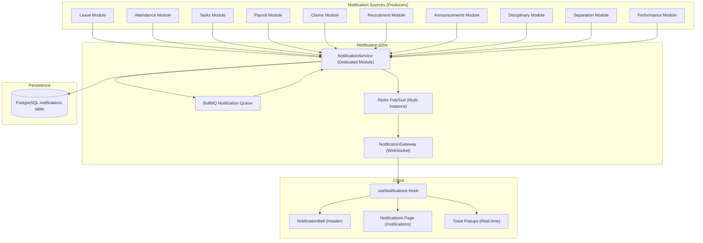

# 🔔 Notifications System — Master Architecture Plan

## 1. Current State Analysis

| Aspect | Current State | Problem |
|---|---|---|
| **Table** | `task_notifications` | Scoped only to tasks, not system-wide |
| **Service** | Embedded in `TasksService` | Tightly coupled, other modules can't emit notifications cleanly |
| **API** | `GET /tasks/notifications` | Wrong namespace — notifications aren't a "task" sub-resource |
| **Real-time** | ❌ None | Header polls via TanStack Query, no WebSocket push |
| **Coverage** | Only 7 triggers in tasks module | Leave, attendance, payroll, claims, recruitment, etc. are silent |
| **Types** | Free-text `title` + `message` | No category, no priority, no action links, no grouping |

---

## 2. Target Architecture



---

## 3. Database Schema

### New `notifications` table (replaces `task_notifications`)

| Column | Type | Purpose |
|---|---|---|
| `id` | UUID PK | Unique ID |
| `created_at` | TIMESTAMPTZ | Created timestamp |
| `updated_at` | TIMESTAMPTZ | Updated timestamp |
| `recipient_id` | UUID FK → employees | Who receives this notification |
| `actor_id` | UUID FK → employees (nullable) | Who triggered it (e.g., the approver) |
| `module` | VARCHAR(50) | Source module: `leave`, `attendance`, `tasks`, `payroll`, `claims`, `recruitment`, `announcements`, `disciplinary`, `separation`, `performance` |
| `category` | VARCHAR(50) | Action type: `approval`, `rejection`, `assignment`, `mention`, `reminder`, `status_change`, `comment`, `system` |
| `priority` | VARCHAR(20) | `low`, `normal`, `high`, `urgent` |
| `title` | VARCHAR(255) | Short title |
| `message` | TEXT | Body text |
| `entity_type` | VARCHAR(50) nullable | e.g., `leave_application`, `task`, `claim` |
| `entity_id` | UUID nullable | Link to the source entity |
| `action_url` | VARCHAR(500) nullable | Deep link: `/leave`, `/tasks?project=xxx`, `/claims/medical` |
| `is_read` | BOOLEAN | Default false |
| `read_at` | TIMESTAMPTZ nullable | When it was read |
| `metadata` | JSONB nullable | Extra context (e.g., `{ "leaveType": "Sick", "days": 3 }`) |

### Indexes

```sql
-- Hot path: header bell unread count
CREATE INDEX idx_notifications_recipient_unread
  ON notifications (recipient_id, is_read, created_at DESC);

-- Module filtering on notifications page
CREATE INDEX idx_notifications_recipient_module
  ON notifications (recipient_id, module, created_at DESC);

-- Entity-based lookups ("notifications for this task/leave")
CREATE INDEX idx_notifications_entity
  ON notifications (entity_type, entity_id);
```

---

## 4. Backend Module Structure

### Directory Layout

```
src/modules/notifications/
├── notifications.module.ts          # Dedicated NestJS module
├── notifications.service.ts         # Core CRUD + emit logic
├── notifications.controller.ts      # REST API endpoints
├── notifications.gateway.ts         # WebSocket gateway for real-time push
├── notifications.processor.ts       # BullMQ worker for async/digest jobs
├── dto/
│   └── notifications.dto.ts         # Query/filter DTOs
└── types/
    └── notification.types.ts        # Enums, interfaces
```

### 4.1 NotificationService — Core API

```typescript
@Injectable()
export class NotificationService {
  constructor(
    @Inject(DB_CONNECTION) private readonly db: Database,
    @InjectQueue(NOTIFICATION_QUEUE) private readonly queue: Queue,
    private readonly gateway: NotificationGateway,
    @Inject(REDIS_CLIENT) private readonly redis: Redis,
  ) {}

  // ─── Emit (called by any module) ───────────────────────────────
  async emit(dto: EmitNotificationDto): Promise<Notification> {
    // 1. Persist to DB
    // 2. Push via WebSocket (real-time)
    // 3. Optionally enqueue for email/digest (future)
  }

  async emitBulk(dtos: EmitNotificationDto[]): Promise<void> {
    // Batch insert + broadcast for high-volume scenarios
  }

  // ─── CRUD ──────────────────────────────────────────────────────
  async findAll(recipientId: string, query: NotificationQueryDto)
  async getUnreadCount(recipientId: string)
  async markAsRead(id: string, recipientId: string)
  async markAllAsRead(recipientId: string)
  async delete(id: string, recipientId: string)
  async deleteAllRead(recipientId: string)
}
```

### 4.2 EmitNotificationDto (what other modules call)

```typescript
export class EmitNotificationDto {
  recipientId: string;          // Who gets it
  actorId?: string;             // Who caused it
  module: NotificationModule;   // 'leave' | 'attendance' | 'tasks' | ...
  category: NotificationCategory; // 'approval' | 'assignment' | ...
  priority?: 'low' | 'normal' | 'high' | 'urgent';
  title: string;
  message: string;
  entityType?: string;          // 'leave_application'
  entityId?: string;            // UUID of the entity
  actionUrl?: string;           // '/leave'
  metadata?: Record<string, any>;
}
```

### 4.3 REST API Endpoints

| Method | Endpoint | Purpose |
|---|---|---|
| `GET` | `/notifications` | List notifications (paginated, filterable by module/category/read) |
| `GET` | `/notifications/unread-count` | Quick count for badge (lightweight) |
| `PATCH` | `/notifications/:id/read` | Mark single as read |
| `POST` | `/notifications/mark-all-read` | Mark all as read |
| `DELETE` | `/notifications/:id` | Delete a notification |
| `DELETE` | `/notifications/read` | Delete all read notifications |

### 4.4 NotificationQueryDto

```typescript
export class NotificationQueryDto {
  @IsOptional() @IsString()
  module?: string;          // Filter by module

  @IsOptional() @IsString()
  category?: string;        // Filter by category

  @IsOptional() @IsString()
  isRead?: string;          // 'true' | 'false'

  @IsOptional() @IsString()
  cursor?: string;          // Cursor-based pagination (matches announcements pattern)

  @IsOptional() @IsInt() @Max(50)
  limit?: number;           // Default 20, max 50
}
```

### 4.5 NotificationGateway — WebSocket Real-Time Push

```typescript
@WebSocketGateway(WS_PORT, { path: '/ws/notifications' })
export class NotificationGateway {
  // Architecture mirrors chat.gateway.ts:
  // 1. Authenticate via JWT token in query param
  // 2. Maintain localClients Map<employeeId, WebSocket[]>
  // 3. Subscribe to Redis channel 'notification_events'
  // 4. On new notification → push to specific user's sockets
  // 5. Heartbeat ping/pong every 30s
  // 6. Multi-tab support (multiple sockets per user)

  pushToUser(employeeId: string, event: string, data: any) {
    // Deliver to all open tabs for that user
  }
}
```

#### WebSocket Events

| Event | Direction | Payload |
|---|---|---|
| `notification_new` | Server → Client | Full notification object |
| `notification_read` | Server → Client | `{ id }` |
| `notification_mark_all_read` | Server → Client | `{}` |
| `notification_deleted` | Server → Client | `{ id }` |
| `connection_ack` | Server → Client | `{ status: 'connected' }` |

### 4.6 NotificationProcessor — BullMQ Worker

```typescript
@Processor(NOTIFICATION_QUEUE)
export class NotificationProcessor extends WorkerHost {
  // Job types:
  // 1. 'send-notification' — async emit with retry
  // 2. 'batch-notification' — bulk insert for announcements
  // 3. 'daily-digest' — scheduled cron job (future)
  // 4. 'cleanup-old-notifications' — purge read notifications older than 90 days
}
```

### 4.7 NotificationsModule Registration

```typescript
@Module({
  imports: [
    BullModule.registerQueue({ name: NOTIFICATION_QUEUE }),
  ],
  controllers: [NotificationsController],
  providers: [NotificationService, NotificationGateway, NotificationProcessor],
  exports: [NotificationService], // Other modules import this
})
export class NotificationsModule {}
```

---

## 5. Integration Points — Where Notifications Fire

### 5.1 Leave Module

| Trigger | Recipient | Category | Priority | actionUrl |
|---|---|---|---|---|
| Employee applies for leave | Manager/HR | `approval` | Normal | `/leave` |
| Leave approved | Employee | `status_change` | Normal | `/leave` |
| Leave rejected | Employee | `status_change` | High | `/leave` |
| Leave cancelled by employee | Manager/HR | `status_change` | Normal | `/leave` |
| Leave balance low (< 2 days) | Employee | `reminder` | Low | `/leave` |

### 5.2 Attendance Module

| Trigger | Recipient | Category | Priority | actionUrl |
|---|---|---|---|---|
| Late check-in | Employee | `reminder` | Low | `/attendance` |
| Absent (auto-marked) | Employee + Manager | `system` | High | `/attendance` |
| Correction request submitted | HR/Admin | `approval` | Normal | `/attendance` |
| Correction approved/rejected | Employee | `status_change` | Normal | `/attendance` |

### 5.3 Tasks Module (migrate existing)

| Trigger | Recipient | Category | Priority | actionUrl |
|---|---|---|---|---|
| Task assigned | Assignee | `assignment` | Normal | `/tasks` |
| Task status changed | Assignee + Reporter | `status_change` | Normal | `/tasks` |
| Priority changed | Assignee | `status_change` | High | `/tasks` |
| Due date approaching (24h) | Assignee | `reminder` | High | `/tasks` |
| Overdue task | Assignee + Manager | `reminder` | Urgent | `/tasks` |
| Comment added | Assignee | `comment` | Normal | `/tasks` |
| @mention in comment | Mentioned users | `mention` | High | `/tasks` |

### 5.4 Payroll Module

| Trigger | Recipient | Category | Priority | actionUrl |
|---|---|---|---|---|
| Payslip generated | Employee | `system` | Normal | `/payroll` |
| Payroll processed (batch) | All employees | `system` | Normal | `/payroll` |
| Festival bonus approved | Employee | `system` | Normal | `/payroll` |

### 5.5 Claims Module

| Trigger | Recipient | Category | Priority | actionUrl |
|---|---|---|---|---|
| Claim submitted | HR/Admin | `approval` | Normal | `/claims/medical` or `/claims/tada` |
| Claim approved | Employee | `status_change` | Normal | `/claims` |
| Claim rejected | Employee | `status_change` | High | `/claims` |

### 5.6 Recruitment Module

| Trigger | Recipient | Category | Priority | actionUrl |
|---|---|---|---|---|
| New application received | HR/Recruiter | `system` | Normal | `/recruitment` |
| Candidate status changed | Candidate (if internal) | `status_change` | Normal | `/recruitment` |
| Interview scheduled | Interviewer + Candidate | `reminder` | High | `/recruitment` |

### 5.7 Announcements Module

| Trigger | Recipient | Category | Priority | actionUrl |
|---|---|---|---|---|
| New announcement published | All/targeted employees | `system` | Normal | `/announcements` |

### 5.8 Performance Module

| Trigger | Recipient | Category | Priority | actionUrl |
|---|---|---|---|---|
| Review assigned to manager | Manager | `assignment` | Normal | `/performance` |
| Review completed | Employee | `status_change` | Normal | `/performance` |

### 5.9 Disciplinary / Separation

| Trigger | Recipient | Category | Priority | actionUrl |
|---|---|---|---|---|
| Disciplinary action created | Employee | `system` | Urgent | `/disciplinary` |
| Separation request submitted | HR/Admin | `approval` | High | `/separation` |
| Separation approved | Employee | `status_change` | High | `/separation` |

---

## 6. Frontend Architecture

### 6.1 New Files

```
client/src/
├── hooks/
│   └── useNotifications.ts            # Dedicated hook (replaces useTasks notification hooks)
├── components/
│   └── notifications/
│       ├── notification-bell.tsx       # Header bell (extracted from header.tsx)
│       ├── notification-list.tsx       # List component (reusable)
│       ├── notification-item.tsx       # Single notification card
│       └── notification-icon.tsx       # Module → icon mapper
├── routes/pages/
│   └── notifications.tsx              # Full /notifications page
├── store/
│   └── useNotificationStore.ts        # Zustand store for real-time state
```

### 6.2 useNotificationStore (Zustand)

```typescript
interface NotificationState {
  notifications: Notification[];
  unreadCount: number;
  wsConnected: boolean;

  // Actions
  addNotification: (n: Notification) => void;
  markAsRead: (id: string) => void;
  markAllAsRead: () => void;
  removeNotification: (id: string) => void;
  setNotifications: (list: Notification[]) => void;
  setWsConnected: (v: boolean) => void;
}
```

### 6.3 WebSocket Integration

Add a **second WebSocket hook** `useNotificationSocket()` alongside the existing chat socket. This keeps concerns separated:

```typescript
export function useNotificationSocket() {
  // Connects to ws://host/ws/notifications?token=xxx
  // Listens for: notification_new, notification_read, etc.
  // Updates useNotificationStore on each event
  // Shows a Sonner toast for high/urgent priority items
}
```

Both `useWebSocket()` (chat) and `useNotificationSocket()` run in `App.tsx` inside the authenticated layout.

### 6.4 Notification Bell (Header)

Extract the current bell dropdown from `header.tsx` into `notification-bell.tsx`:
- Real-time badge count from Zustand store (no polling)
- Dropdown shows last 10 unread
- "View All" link → `/notifications` page
- Click notification → navigate to `actionUrl` (deep link)
- Mark as read on click
- Remove TanStack Query polling (replaced by WebSocket push)

### 6.5 Full Notifications Page (`/notifications`)

- Tab filters: **All** | **Unread** | **Leave** | **Tasks** | **Payroll** | **Claims** | etc.
- Cursor-based pagination (matches announcements pattern)
- "Mark All as Read" button
- "Clear Read" button
- Each item shows: module icon, title, message, relative time, read/unread dot
- Click → navigate to actionUrl + mark as read

### 6.6 TypeScript Types

```typescript
export interface Notification {
  id: string;
  createdAt: string;
  updatedAt: string;
  recipientId: string;
  actorId: string | null;
  module: NotificationModule;
  category: NotificationCategory;
  priority: 'low' | 'normal' | 'high' | 'urgent';
  title: string;
  message: string;
  entityType: string | null;
  entityId: string | null;
  actionUrl: string | null;
  isRead: boolean;
  readAt: string | null;
  metadata: Record<string, any> | null;
}

export type NotificationModule =
  | 'leave' | 'attendance' | 'tasks' | 'payroll'
  | 'claims' | 'recruitment' | 'announcements'
  | 'performance' | 'disciplinary' | 'separation';

export type NotificationCategory =
  | 'approval' | 'rejection' | 'assignment' | 'mention'
  | 'reminder' | 'status_change' | 'comment' | 'system';
```

---

## 7. Real-Time Flow (End-to-End)

```
1. Employee submits leave request
   ↓
2. LeaveApplicationService.createAsync()
   → calls NotificationService.emit({ recipientId: managerId, module: 'leave', ... })
   ↓
3. NotificationService:
   a. INSERT INTO notifications (persist to PostgreSQL)
   b. Redis PUBLISH 'notification_events' { type: 'NEW', recipientId, notification }
   c. Return notification object
   ↓
4. NotificationGateway (subscribed to Redis channel 'notification_events'):
   a. Finds local WebSocket connections for recipientId
   b. Sends { event: 'notification_new', data: notification } to all tabs
   ↓
5. Client useNotificationSocket hook:
   a. Receives notification_new event
   b. Adds to Zustand store (useNotificationStore)
   c. Shows Sonner toast if priority is high/urgent
   d. Header bell badge updates instantly (reactive from store)
   ↓
6. User clicks notification in bell dropdown or page
   → Navigate to actionUrl (e.g., /leave)
   → PATCH /notifications/:id/read
   → WebSocket broadcasts notification_read to other tabs
```

---

## 8. Migration Strategy

### Phase 1: Foundation (Backend)
1. Create `notifications` schema in Drizzle (`src/db/schema/notifications.ts`)
2. Write and run Drizzle migration to create `notifications` table
3. Create `NotificationsModule` directory with all files
4. Register `NotificationsModule` in `AppModule`
5. Implement `NotificationService.emit()` with DB persist + Redis Pub/Sub
6. Implement `NotificationGateway` with JWT auth + Redis subscription
7. Implement REST controller with all CRUD endpoints
8. Test endpoints with manual curl/Postman calls

### Phase 2: Frontend Integration
1. Add `useNotificationStore` (Zustand)
2. Add `useNotifications` hook (TanStack Query for initial load + CRUD)
3. Add `useNotificationSocket` hook (WebSocket connection)
4. Extract `notification-bell.tsx` from `header.tsx`
5. Wire bell to use Zustand store (replace TanStack Query polling)
6. Add `/notifications` route in `App.tsx`
7. Build notifications page with tab filters + cursor pagination
8. Add Sonner toast integration for real-time high-priority notifications
9. Add navigation item in sidebar

### Phase 3: Migrate Task Notifications
1. Write data migration: copy `task_notifications` → `notifications` table
2. Replace `TasksService.createNotification()` calls → `NotificationService.emit()`
3. Update all 7 existing `createNotification()` call sites in `tasks.service.ts`
4. Remove old notification endpoints from `TasksController`
5. Remove old notification hooks from `useTasks.ts`
6. Remove old notification import from `header.tsx`
7. Drop `task_notifications` table via migration

### Phase 4: Wire Up All Modules
1. Inject `NotificationService` into each module that needs to emit
2. Add emit calls to:
   - `LeaveApplicationService` (approve/reject/cancel)
   - `AttendanceService` (late/absent/correction)
   - `ClaimsService` (submit/approve/reject)
   - `PayrollService` (payslip generated)
   - `RecruitmentService` (application/status change)
   - `AnnouncementsService` (published)
   - `PerformanceService` (review assigned/completed)
   - `DisciplinaryService` (action created)
   - `SeparationService` (request submitted/approved)

### Phase 5: Polish (Future)
1. Scheduled daily digest (BullMQ cron) — summary of unread notifications
2. Notification preferences per module (mute/unmute)
3. Browser push notifications (Web Push API)
4. Email notification delivery channel
5. Auto-cleanup: purge read notifications older than 90 days

---

## 9. Key Design Decisions

| Decision | Rationale |
|---|---|
| **Separate NestJS module** | Any module can emit via DI without circular dependencies |
| **Redis Pub/Sub for real-time** | Matches existing chat architecture, scales to multiple instances |
| **WebSocket separate from chat** | Different lifecycle, different path (`/ws/notifications`), no coupling |
| **PostgreSQL for storage** | Persistent, queryable, paginatable — Redis is only transport |
| **Cursor-based pagination** | Consistent with announcements pattern, handles large volumes |
| **Zustand for real-time state** | Optimistic updates, instant UI reactivity — same as chat store |
| **actionUrl deep links** | Google-standard: clicking takes you to the exact entity |
| **actorId tracking** | Enables "X approved your leave" instead of generic messages |
| **metadata JSONB** | Flexible per-module context without schema changes |
| **priority levels** | Enables toast vs silent vs badge-only delivery strategies |

---

## 10. File Change Summary

### New Files (Backend)
| File | Purpose |
|---|---|
| `src/db/schema/notifications.ts` | Drizzle schema for notifications table |
| `src/modules/notifications/notifications.module.ts` | NestJS module definition |
| `src/modules/notifications/notifications.service.ts` | Core emit + CRUD logic |
| `src/modules/notifications/notifications.controller.ts` | REST API endpoints |
| `src/modules/notifications/notifications.gateway.ts` | WebSocket real-time gateway |
| `src/modules/notifications/notifications.processor.ts` | BullMQ async worker |
| `src/modules/notifications/dto/notifications.dto.ts` | Request validation DTOs |
| `src/modules/notifications/types/notification.types.ts` | Enums and interfaces |

### New Files (Frontend)
| File | Purpose |
|---|---|
| `src/store/useNotificationStore.ts` | Zustand store |
| `src/hooks/useNotifications.ts` | TanStack Query hooks |
| `src/hooks/useNotificationSocket.ts` | WebSocket connection hook |
| `src/components/notifications/notification-bell.tsx` | Header bell component |
| `src/components/notifications/notification-list.tsx` | Reusable list component |
| `src/components/notifications/notification-item.tsx` | Single notification card |
| `src/components/notifications/notification-icon.tsx` | Module → icon mapper |
| `src/routes/pages/notifications.tsx` | Full notifications page |
| `src/types/notifications.ts` | TypeScript types |

### Modified Files
| File | Change |
|---|---|
| `src/app.module.ts` | Add NotificationsModule import |
| `src/db/schema/index.ts` | Export notifications schema |
| `src/modules/queue/queue.module.ts` | Add NOTIFICATION_QUEUE constant |
| `client/src/App.tsx` | Add useNotificationSocket + /notifications route |
| `client/src/layouts/header.tsx` | Replace inline bell with NotificationBell component |
| `client/src/layouts/sidebar.tsx` | Add notifications nav item |
| `client/src/components/navigation/nav-data.ts` | Add notifications to navigation |
| `src/modules/tasks/tasks.service.ts` | Replace createNotification → NotificationService.emit |
| `src/modules/tasks/tasks.controller.ts` | Remove notification endpoints |
| `src/modules/tasks/tasks.module.ts` | Import NotificationsModule |
| `src/modules/leave-application/leave-application.service.ts` | Add emit calls |
| `src/modules/attendance/attendance.service.ts` | Add emit calls |
| `src/modules/claims/claims.service.ts` | Add emit calls |
| `src/modules/payroll/payroll.service.ts` | Add emit calls |
| `src/modules/recruitment/recruitment.service.ts` | Add emit calls |
| `src/modules/announcements/announcements.service.ts` | Add emit calls |
| `src/modules/performance/performance.service.ts` | Add emit calls |
| `src/modules/disciplinary/disciplinary.service.ts` | Add emit calls |
| `src/modules/separation/separation.service.ts` | Add emit calls |

### Migration Files
| File | Purpose |
|---|---|
| `src/db/migrations/XXXX_create_notifications.sql` | Create notifications table + indexes |
| `src/db/migrations/YYYY_migrate_task_notifications.sql` | Copy data from task_notifications → notifications |
| `src/db/migrations/ZZZZ_drop_task_notifications.sql` | Drop old task_notifications table |
